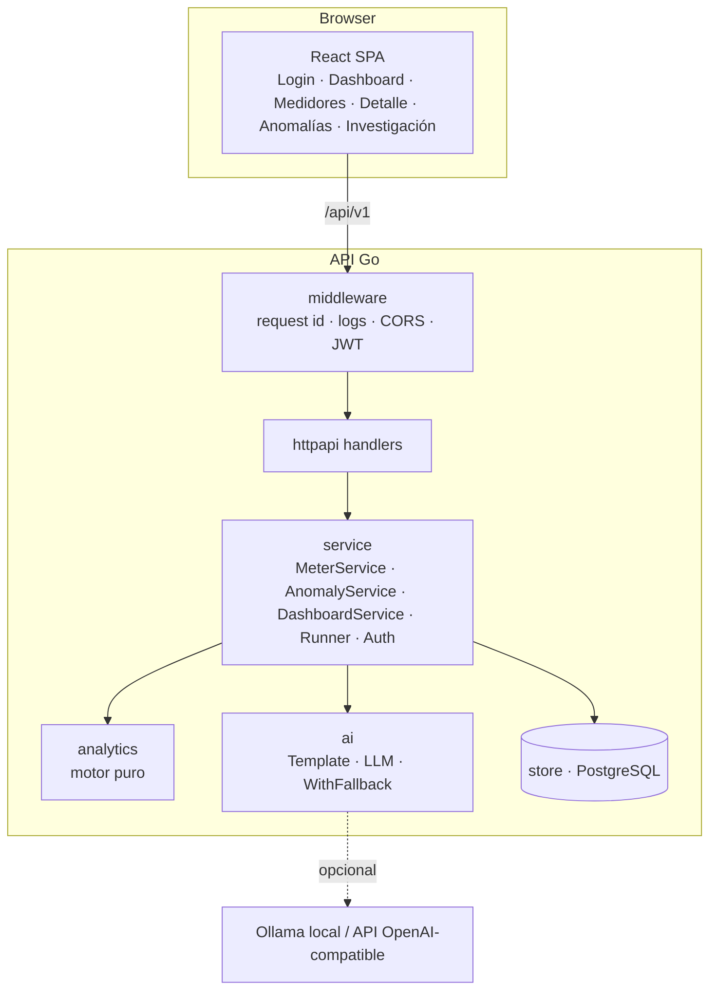
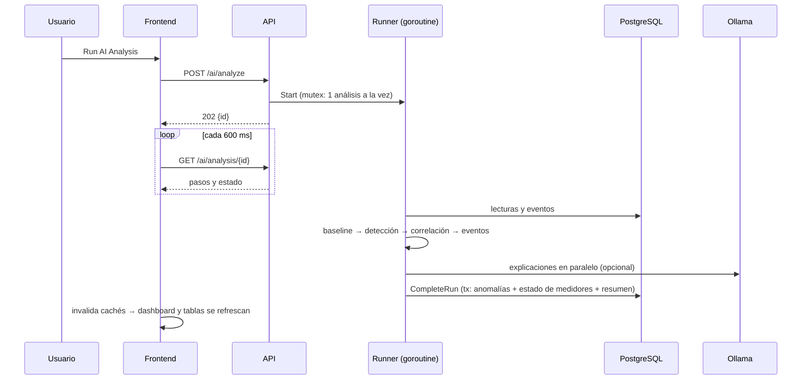
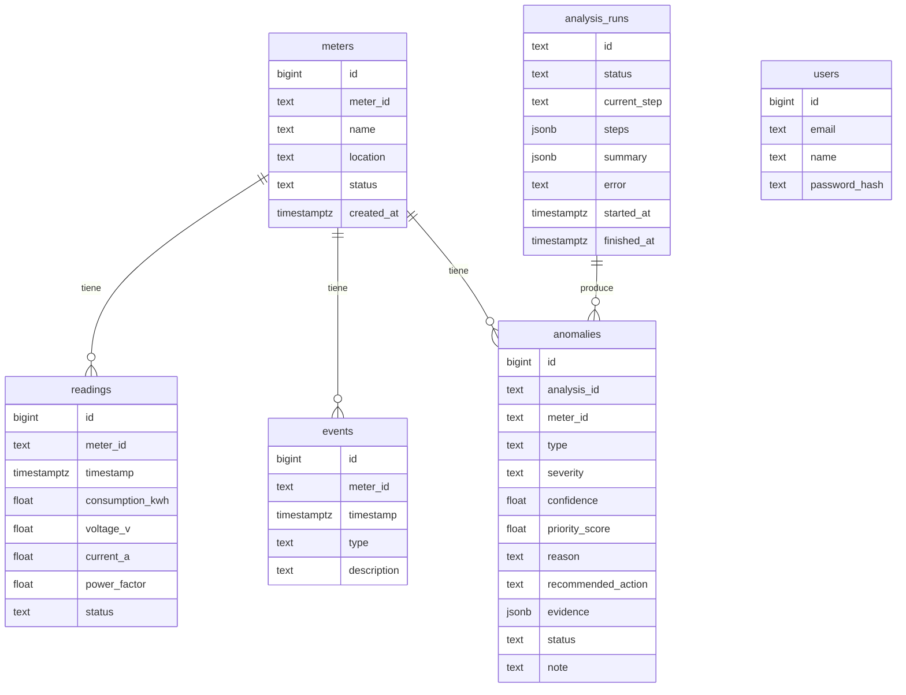

# Arquitectura

## Vista general

Capas: `handler → service → repository`. Los handlers no acceden a SQL. Los servicios dependen de la interfaz `service.Repository`, implementada por `store.Store` (PostgreSQL) y `memstore.Store` (tests), así que la API completa se prueba sin base de datos.

## Flujo de Run AI Analysis

- Cada paso se persiste en `analysis_runs.steps` (JSONB) con su estado, detalle y tiempos.
- `ANALYSIS_STEP_DELAY_MS` fija una duración visible mínima por paso para la demo.
- Al arrancar, los análisis que quedaron `RUNNING` por un reinicio se marcan `FAILED`.

## Modelo de datos

- `anomalies.evidence` (JSONB) guarda todo lo que respalda el hallazgo: variables antes y después, señales, eventos evaluados y el desglose de confianza y prioridad.
- **Estado del medidor**, derivado de sus anomalías activas: `CRITICAL` si hay una real de severidad alta, `ALERT` si hay otra alta o media, `OK` en el resto de casos. Resolver o descartar una anomalía recalcula el estado.
- Las decisiones del operador se conservan entre análisis para el mismo medidor y tipo.

## Seguridad

- JWT HS256 con expiración, emisor validado y algoritmo fijo.
- Contraseñas con bcrypt. El login compara contra un hash ficticio si el usuario no existe, para no filtrar qué correos están registrados.
- Cuerpos JSON limitados a 64 KB y sin campos desconocidos. Los errores internos se registran en el log y no se exponen al cliente.
- La imagen de la API usa `distroless:nonroot`.

## Frontend

- React Router con rutas cargadas bajo demanda. La librería de gráficos va en un chunk aparte.
- TanStack Query para la caché. Un 401 cierra la sesión. Cuando termina un análisis se invalidan todas las consultas.
- Tokens de diseño en CSS (claro y oscuro con selector). Los colores de estado se reservan para la severidad y siempre van con icono y etiqueta.
- Cada gráfico tiene tooltip y **vista de tabla** accesible.
